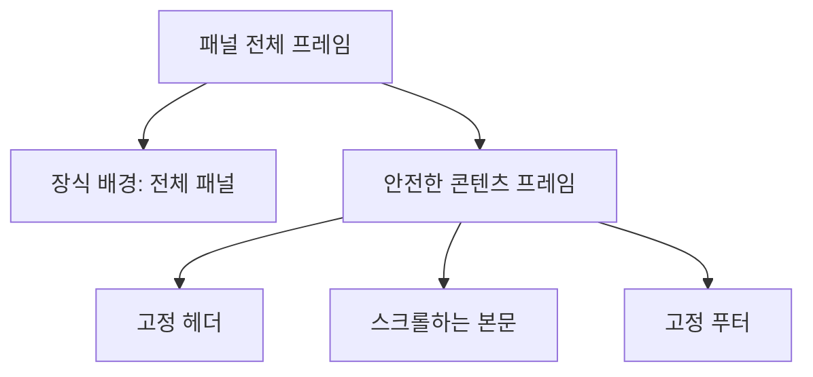

# AxiomSideMenu 사용법과 구현 기준

작성: 2026-10-08. 실제 소스와 2026-10-07~08 패키지 resolution·Simulator 실행 결과 기준.

## 1. 사용할 버전과 API

| 버전·소비자 | API | 사용 기준 |
| --- | --- | --- |
| SDK 0.1.3 | `SideMenu` 루트 + 기존 `.sideMenu(...)` | 전체 화면은 새 root를 기본으로 사용 |
| SDK 0.1.2 | `.sideMenu(...)` | 기존 호스트에 붙일 때 사용 |
| Sumday | **exact 0.1.2** + `SumdayDesign.paperSidebar(...)` | 실제 앱 메뉴 흐름 확인, 요청한 버전 유지 |

이 문서는 **0.1.3 출시용 가이드**다. 실제 배포 태그는 [GitHub 릴리스](https://github.com/axiom-orient/AxiomSideMenu/releases)에서 확인한다. 0.1.2에는 `SideMenu` 타입이 없고 0.1.3부터 추가된다. 아래 전체 예제는 호환되는 modifier를 사용하므로 0.1.2에서도 컴파일된다.

Swift 6 언어 모드, iOS 17+, macOS 14+, Mac Catalyst 17+를 선언한다. 실제 사용한 컴파일러는 Swift 6.4다. 최소 OS와 데스크톱 GUI까지 실행 검증한 것은 아니다.

SwiftPM 설치:

```swift
.package(
  url: "https://github.com/axiom-orient/AxiomSideMenu.git",
  exact: "0.1.3"
)
```

소비자 target에는 `.product(name: "AxiomSideMenu", package: "AxiomSideMenu")`를 추가한다. Xcode에서는 같은 URL을 추가하고 새 root를 사용하려면 Exact Version 0.1.3을 선택한다. Sumday처럼 0.1.2 유지가 필요하면 해당 버전을 선택한다.

## 2. 기존 modifier로 바로 사용하기 — 0.1.2 이상

메뉴를 담을 **루트 뷰에**, `NavigationStack` 바깥에서 붙인다. 메뉴의 표시 상태는 앱이 소유하는 `Binding<Bool>` 하나다.

```swift
import AxiomSideMenu
import SwiftUI

struct SidebarExample: View {
  @State private var isMenuOpen = false
  @State private var selectedTitle = "홈"

  var body: some View {
    NavigationStack {
      VStack(spacing: 20) {
        Text(selectedTitle)
        Button("메뉴 열기") { isMenuOpen = true }
      }
      .navigationTitle("기록")
    }
    .frame(maxWidth: .infinity, maxHeight: .infinity)
    .sideMenu(isPresented: $isMenuOpen, edge: .leading, width: 280) {
      VStack(alignment: .leading, spacing: 16) {
        HStack {
          Text("메뉴").font(.headline)
          Spacer()
          Button { isMenuOpen = false } label: {
            Image(systemName: "xmark")
              .frame(minWidth: 44, minHeight: 44)
          }
          .accessibilityLabel("메뉴 닫기")
        }

        ScrollView {
          VStack(alignment: .leading, spacing: 12) {
            ForEach(["홈", "내 기록", "설정"], id: \.self) { title in
              Button(title) {
                selectedTitle = title
                isMenuOpen = false
              }
              .frame(maxWidth: .infinity, minHeight: 44, alignment: .leading)
            }
          }
        }
        .frame(maxWidth: .infinity, maxHeight: .infinity, alignment: .topLeading)

        Text("내 기록 앱").font(.footnote).foregroundStyle(.secondary)
      }
      .padding(16)
    }
  }
}
```

이 예시는 실제 화면 전환 대신 `selectedTitle`을 바꾼다. 앱에서는 해당 위치에 기존 라우팅을 연결하고 같은 표시 상태를 닫으면 된다.

`frame(maxWidth:maxHeight:)`는 작은 메인 콘텐츠가 메뉴 호스트의 크기를 줄이지 않도록 한다. 0.1.2 modifier의 범위는 호스트가 제공한 영역이다. 부모의 clipping·navigation·safe-area 설정까지 자동으로 복구하는 API는 아니다.

### 권장 루트 API — 0.1.3

새 API는 메인 화면과 메뉴를 한 루트에 담고, 작은 메인 뷰에도 전체 캔버스를 제공한다. `NavigationStack`을 **content 안에** 둔다.

```swift
SideMenu(isPresented: $isMenuOpen, edge: .leading, width: 280) {
  NavigationStack { MainScreen() }
} menu: {
  MenuScreen(onClose: { isMenuOpen = false })
} background: {
  Image("SidebarPaper").resizable().scaledToFill()
}
```

이 코드는 화면 구성을 설명하는 조각이다. `MainScreen`, `MenuScreen`, `SidebarPaper`는 앱이 제공한다. background를 생략하면 시스템 기본 배경을 사용한다. 기존 modifier 5개 서명은 유지된다.

컨테이너도 조상 뷰가 잘라 버린 영역이나 이미 버린 safe-area 정보를 복구하지 못한다. 화면 루트에 배치한다.

## 3. 배경과 콘텐츠의 시작점

**배경은 패널 전체에, 조작 가능한 콘텐츠는 안전 영역 안에** 배치한다.

| 영역 | 배치 기준 |
| --- | --- |
| 배경 | 패널의 상태 표시줄·홈 인디케이터 영역까지 채움 |
| 헤더·메뉴 항목·푸터 | 호스트의 안전한 콘텐츠 영역 안에서 시작 |
| 일반 디자인 간격 | 메뉴 안의 `.padding(16)`처럼 앱이 추가 |
| 추가 상단 예약 | `contentInsets.top`에 앱이 측정한 높이를 전달 |

이번 iPhone 실행에서 상태 표시줄 아래 시작점은 62pt였다. **62pt는 관측값이며 구현 상수가 아니다.** 기기·회전·컨테이너에 따라 안전 영역은 달라진다.



### 이미지 배경

이미지는 메뉴 콘텐츠의 `.background`에 붙이는 대신 SDK의 별도 closure에 전달한다.

```swift
mainRoot
  .sideMenu(isPresented: $isMenuOpen) {
    MenuScreen(onClose: { isMenuOpen = false })
  } background: {
    Image("SidebarPaper").resizable().scaledToFill()
  }
```

SDK가 전체 패널 크기를 제공하고 경계에서 clip한다. `scaledToFill()`은 영역을 채우며 이미지 일부를 자를 수 있다. background 안의 버튼과 접근성 요소는 비활성이다. 실제 버튼은 menu closure에 둔다.

색·그라데이션·material은 ShapeStyle overload로도 전달할 수 있다.

```swift
mainRoot.sideMenu(isPresented: $isMenuOpen, background: Color.indigo) {
  MenuScreen(onClose: { isMenuOpen = false })
}
```

### 네비게이션바만큼 더 내려야 할 때

루트에 붙인 메뉴는 기본적으로 상태 표시줄 아래에서 시작하며 메인 화면의 네비게이션바를 덮을 수 있다. 콘텐츠만 추가로 내리려면 측정한 높이를 전달한다.

```swift
mainRoot.sideMenu(
  isPresented: $isMenuOpen,
  contentInsets: EdgeInsets(
    top: measuredBarHeight, leading: 0, bottom: 0, trailing: 0
  )
) {
  MenuScreen(onClose: { isMenuOpen = false })
}
```

`measuredBarHeight`는 앱이 소유한 바의 실제 높이인 `CGFloat`다. 자체 헤더라면 해당 뷰에 `onGeometryChange`를 붙여 측정할 수 있다. 모든 시스템 네비게이션바가 44pt라고 가정하지 않는다. 상태 표시줄 높이를 다시 합산하지 않는다.

`contentInsets`는 이미 안전한 영역 **안의 추가 공간**이다. 배경 크기를 줄이지 않는다. 음수·비유한 값은 0으로 정규화되고, 합산 공간은 사용 가능한 콘텐츠 범위로 제한된다.

## 4. 헤더·스크롤·푸터를 구성하는 방법

헤더와 푸터를 `ScrollView` 또는 `List` 바깥에 둔다. 가운데 본문에만 남은 높이를 제공한다. 위의 전체 예시가 이 구조다.

List를 쓰면 기본 스크롤 배경을 숨겨 패널 배경을 드러낸다.

```swift
List {
  // 앱이 소유하는 메뉴 항목
}
.scrollContentBackground(.hidden)
```

앱의 공통 스타일이 별도 이미지 배경을 그린다면 그 배경도 공통 스타일에서 관리해야 한다. 이미 그린 배경 위에 `.background(.clear)`를 추가해도 기존 배경이 제거되지는 않는다. SDK는 임의의 자식 뷰 배경을 삭제하지 않는다.

Sumday는 SDK background closure에 `PaperTexture()`를 한 번 전달한다. private wrapper가 내부 환경값을 제공해 메뉴 안의 `paperListContent()` 중복 texture를 생략한다. 독립 `PaperSidebar`와 일반 List는 기존 기본 배경을 보존한다. 앱마다 같은 스타일 코드를 복제하지 않고 공유 디자인 모듈에서 이 경계를 정한다.

## 5. 왼쪽·오른쪽과 RTL

`edge`는 물리 방향이 아니라 **논리 방향**인 `HorizontalEdge`다.

| 설정 | LTR | RTL |
| --- | --- | --- |
| `.leading` | 왼쪽 | 오른쪽 |
| `.trailing` | 오른쪽 | 왼쪽 |

현재 한국어 LTR 화면에서 오른쪽 메뉴는 `edge: .trailing`이다. 상하 방향은 구현 범위가 아니다.

물리 왼쪽을 고정해야 한다면 현재 `layoutDirection`에 따라 edge를 선택한다. 메뉴 방향 때문에 화면 전체의 텍스트 방향을 강제로 바꾸지 않는다.

## 6. 버튼·코드·AI 액션에서 열고 닫기

앱은 표시 Binding만 변경한다. 위치와 애니메이션은 SDK가 처리한다.

```swift
isMenuOpen = true   // 열기
isMenuOpen = false  // 닫기
```

공유 명령 처리기가 필요하면 앱이 메인 액터에 표시 모델을 둔다.

```swift
import Observation

@MainActor
@Observable
final class SidebarState {
  var isPresented = false

  func open() { isPresented = true }
  func close() { isPresented = false }
}
```

뷰는 이 모델의 `isPresented`에 bind한다. 다른 액터의 agent/tool handler는 `await sidebar.close()`를 호출할 수 있다. 라이브러리가 AI provider나 tool registry를 설치하는 것은 아니다. 앱이 해당 명령을 연결한다.

실행 중인 드래그보다 앱의 새 상태 변경이 우선한다. 화면 전환, 잠금, sheet, 앱 명령 때문에 닫은 뒤 오래된 드래그 종료가 다시 열지 않도록 하는 계약이다. 선택·라우팅·DB 상태는 앱에 남긴다.

메뉴가 완전히 닫히면 menu view는 제거된다. 계속 유지할 선택·설정은 menu 내부의 로컬 상태에만 저장하지 않는다.

## 7. 드래그와 애니메이션 계약

- 선택한 가장자리의 첫 28pt에서 안쪽 드래그로 연다.
- 열린 패널을 바깥으로 드래그하거나 바깥의 어두운 영역을 눌러 닫는다.
- 패널은 손가락을 따라 움직이며, 손을 뗀 **최종 보이는 위치**로 상태를 결정한다.
- 절반보다 더 보이면 열고, 덜 보이면 닫는다. 정확히 절반이면 인식 시점의 committed 상태를 유지한다.
- 속도·예측 종료점·과거 최대 이동 거리는 절반 규칙을 건너뛰지 않는다.
- 버튼·명령·거절된 드래그는 현재 보이는 위치에서 목표 위치로 정착한다.
- 닫기 애니메이션 중 보이는 패널을 다시 잡는 동작을 지원하는 계약이다.

완전히 열림 또는 닫힘에서 시작한 **실제 폭 280pt** 패널의 예:

| 이동 | 열린 상태에서 닫으려는 드래그 | 닫힌 상태에서 열려는 드래그 |
| --- | --- | --- |
| 100pt | 다시 열림 | 다시 닫힘 |
| 정확히 140pt | 열린 상태 유지 | 닫힌 상태 유지 |
| 170pt | 닫힘 | 열림 |

애니메이션 중 다시 잡을 때는 중간 위치에서 시작한다. 이때 이동량만 절반과 비교하는 구현은 틀리며 최종 보이는 폭을 비교해야 한다.

## 8. 라이브러리를 명확하게 구현하는 기준

### 책임을 나누기

| 책임 | 소유자 |
| --- | --- |
| committed 표시 상태 | 앱의 Binding |
| 선택·화면 전환·영구 데이터·agent 명령 | 앱 |
| 임시 드래그 위치·정착 애니메이션·입력 격리 | SDK |
| 캔버스·안전한 메뉴 영역·전체 배경 프레임 | SDK. modifier는 제공된 호스트 영역을 사용 |
| 헤더·본문·푸터·항목의 디자인 간격 | 앱 또는 공유 디자인 모듈 |

### 좌표와 상태를 한 번만 계산하기

1. 호스트의 실제 크기에서 유효한 패널 폭을 정규화한다.
2. 전체 배경과 안전한 foreground의 프레임을 분리한다.
3. 루트 컨테이너는 container safe-area 차이를 복원하고, 물리 패널과 실제 안전 영역의 교집합을 계산한다. 반대편 센서 여백을 두 패널에 동일하게 더하지 않는다.
4. 추가 contentInsets는 시스템 여백을 적용한 뒤 남은 공간에서 제한한다. 같은 정규화 결과를 렌더링과 변경 감지에 사용한다.
5. 드래그 인식 시점의 상태·현재 표시 위치·유효 generation을 고정한다.
6. 이동 중에는 표시 위치를 업데이트하고, 종료 시 최종 보이는 폭을 판정한다.
7. 외부 상태·크기·방향 변경과 취소는 오래된 입력·완료 callback을 무효화한다.
8. 닫히는 동안 뷰를 유지하고, 완전히 닫힌 뒤 제거한다.

논리 edge와 물리 이동 부호를 분리한다. RTL에서 placement와 offset을 각각 뒤집어 두 번 반전시키는 오류를 회귀 검사로 잡는다.

UIKit/전역 window 조회·앱 라우팅·AI SDK를 메뉴 라이브러리에 섞지 않는다. 실제 frame 측정용 UIKit probe는 예제의 진단 코드이며 라이브러리 구현과 분리돼 있다.

## 9. 자주 생기는 문제

| 증상 | 확인·수정 |
| --- | --- |
| 상단이 과하게 비어 있음 | safe-area padding 중복, 0.1.0 보정 코드, 고정 top padding 확인 |
| 작은 메뉴가 가운데에 배치됨 | SDK의 상단 정렬을 사용하고 메뉴 안의 불필요한 중앙 정렬 제거 |
| 배경이 상태 표시줄을 덮지 않음 | 이미지를 별도 background closure로 이동. 호스트 범위·부모 clipping 확인 |
| 헤더와 목록 배경이 갈라짐 | 공유 스타일에서 배경 소유자를 한 곳으로 정함 |
| 스크롤할 때 헤더도 움직임 | 헤더를 본문 ScrollView/List 밖으로 이동 |
| 바가 메뉴 위에 남음 | modifier를 NavigationStack 밖으로 이동. 새 root는 NavigationStack을 content 안에 배치 |
| 닫힌 메뉴가 다시 나타남 | 앱 상태 권한과 오래된 gesture/completion 무효화 확인 |
| RTL에서 패널이 반대쪽으로 이동 | 논리 placement와 물리 offset을 중복 반전했는지 확인 |
| width 0인데 Binding은 true | 폭 0은 표시·입력만 비활성화하고 앱의 표시 의도는 보존함. 앱 정책상 닫아야 하면 Binding도 변경 |

0.1.0에서 음수 padding으로 중복 안전 여백을 보정했다면 0.1.2로 올릴 때 그 보정을 제거한다. 일반 디자인 간격은 유지한다.

## 10. 실제 근거와 미확인 범위

Sumday의 정상 앱 실행에서 폭340pt, 닫기 버튼 Y=62pt, 100pt 드래그 복귀, 240pt 닫기, 오른쪽 edge230pt 재열기, 버튼·바깥 닫기를 확인했다. 기존 저장소를 초기화하거나 AI provider를 호출하지 않았다. [실제 캡처](/Users/ax/repoMobile/Sumday/.mot-artifacts/side-menu-qa-20261007/latest.png)는 로컬 작업 환경의 파일이다.

0.1.3은 43개 unit test, SDK compile, 기존·새 API 소비자와 루트·가로 화면 배치 근거가 있다. 두 OS에서 25개 기존 시나리오 + 4개 절반 거리 시나리오 + 1개 실제 접촉 기반 다시 잡기를 합쳐 각각 30개를 검증했다. 단일 새 전체 실행의 30/30 PASS로 표현하지 않는다. 테스트 장치 수정·제품 코드 수정·원래 실패·재실행 PASS·실제 게시를 구분한다.

실제 키보드 전환·VoiceOver·물리 기기·최소 OS·데스크톱 GUI 검증은 별도다. Simulator 위치·픽셀 관측을 물리 기기의 frame performance 인증으로 확대하지 않는다.

문서의 `SidebarExample` 전체 코드와 `SidebarState`는 별도 Swift 6 소비자에서 원격 exact0.1.2로 release compile PASS다. 이 확인은 예제의 타입·API 정합성 확인이며 데스크톱 화면 실행을 뜻하지 않는다.

### 소스와 참고 자료

- [공개 modifier API](../Sources/AxiomSideMenu/SideMenu.swift)
- [로컬 루트 컨테이너](../Sources/AxiomSideMenu/SideMenuContainer.swift)
- [상태·제스처 구현](../Sources/AxiomSideMenu/SideMenuModifier.swift)
- [순수 상호작용·기하 규칙](../Sources/AxiomSideMenu/SideMenuInteraction.swift)
- [검증 기록](VERIFICATION.md)
- [오픈소스 참고 및 고정 revision](IMPLEMENTATION_REFERENCES.md)
- [Apple: SwiftUI safe area 설명](https://developer.apple.com/videos/play/wwdc2021/10021/)
